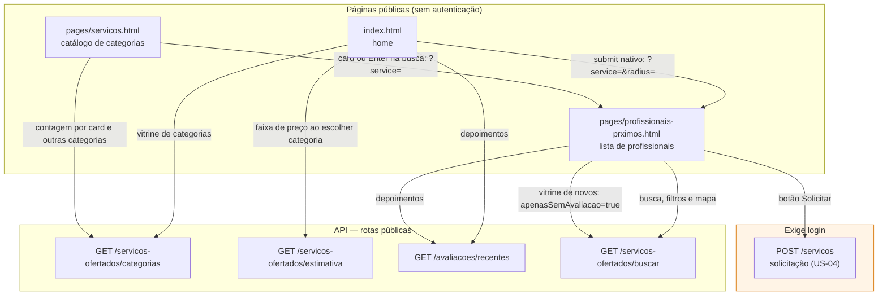
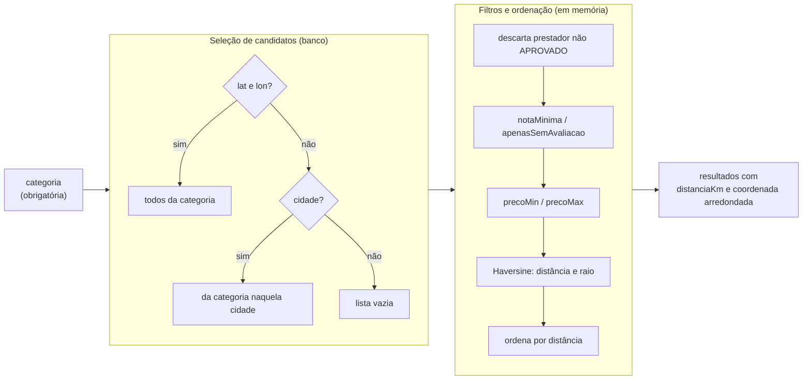
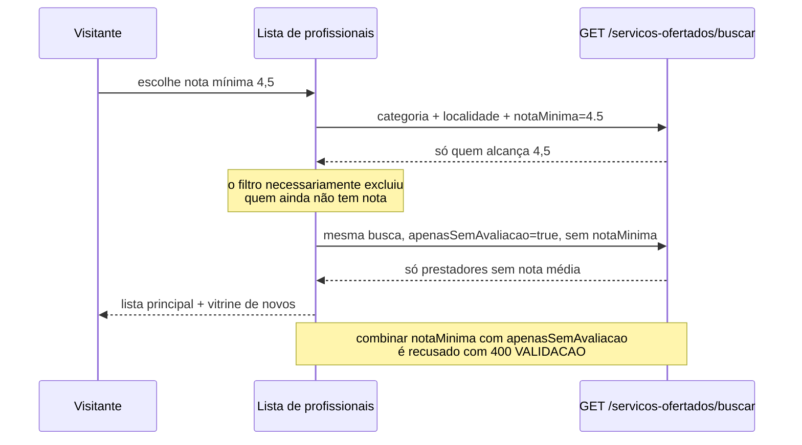

# Fluxo de descoberta pública

Diagrama **descritivo**: documenta o caminho que um visitante sem conta percorre nas páginas
públicas e quais endpoints cada superfície consome, depois da change
`feature-publico-remover-mocks`.

Todas as rotas abaixo são `permitAll` no `SecurityConfig` e todas filtram por serviço `ATIVO` de
prestador `APROVADO` (RN04).

## Superfícies e endpoints

## Filtros da busca e onde são aplicados

Os filtros ficam em memória, no mesmo passo que já descartava prestador não aprovado e calculava
distância, porque a busca já materializa a lista de candidatos para o Haversine — acrescentar
predicados ali não soma carga. Uma consulta com parâmetros anuláveis teria de reproduzir em JPQL a
seleção de três ramos acima. Sem paginação, essa escolha não tem custo realizável; quando paginação
entrar, filtro e paginação devem descer juntos para a query.

## Vitrine "Novos na sua região"

A vitrine só é exibida quando há filtro de nota ativo. Sem esse filtro, os prestadores sem avaliação
já estão na lista principal, e exibi-los também na vitrine mostraria o mesmo prestador duas vezes.
