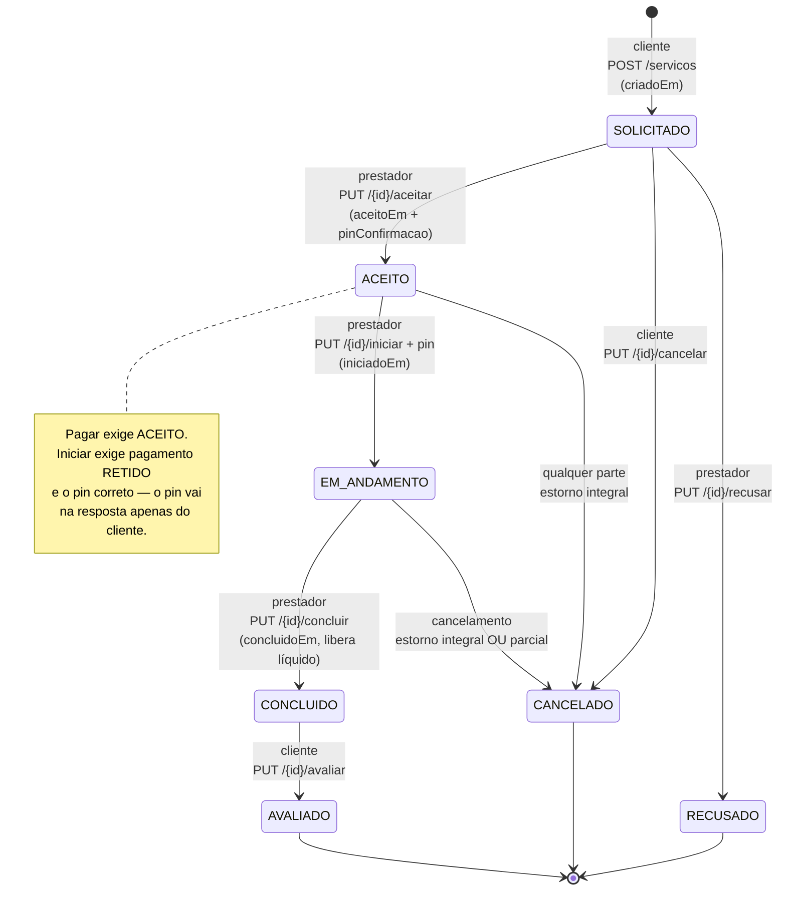
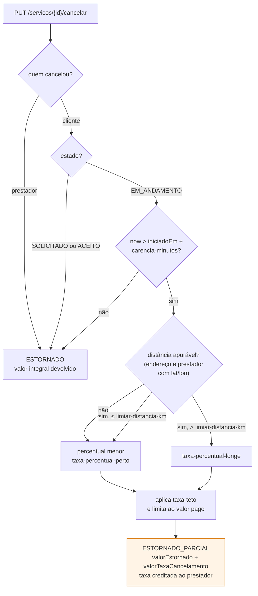
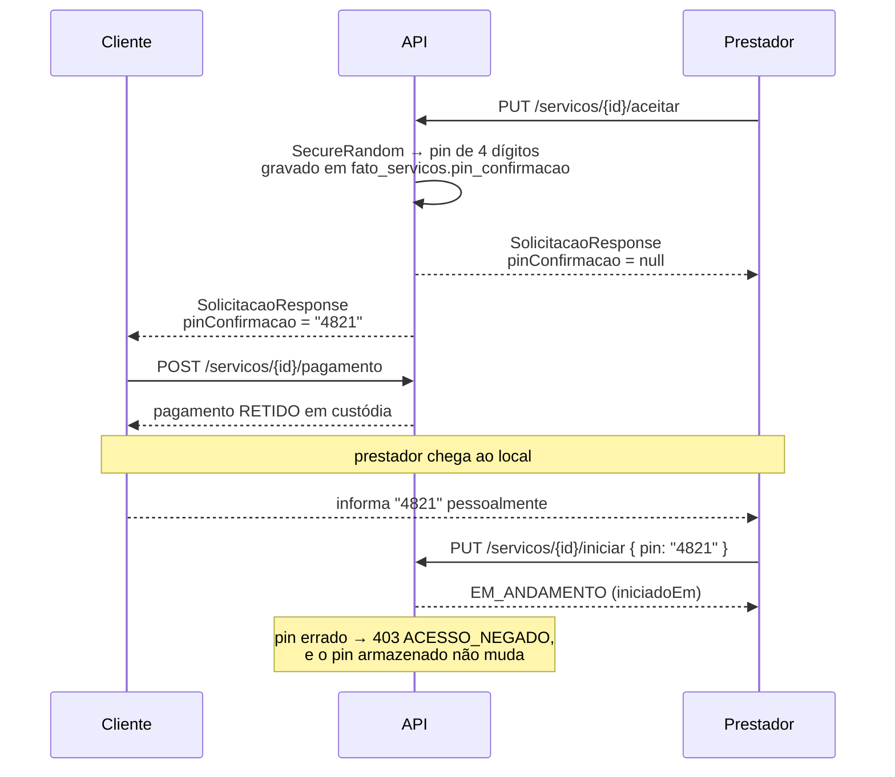
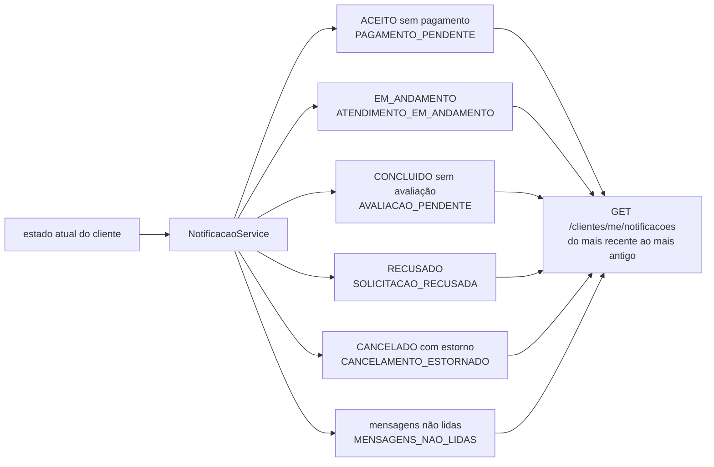

# Fluxo do painel do cliente

Diagrama **descritivo**: documenta cada aba de `pages/painel-cliente.html` e os endpoints que ela
consome depois da change `feature-painel-cliente-remover-mocks`.

Todas as rotas abaixo são autenticadas — nenhuma é `permitAll` no `SecurityConfig` — e todas as que
começam em `/clientes/me` resolvem o cliente pelo token, nunca por id na URL. As rotas de
solicitação (`/servicos/{id}`) são restritas às duas partes envolvidas: qualquer terceiro recebe
403 `ACESSO_NEGADO`.

## Abas e endpoints

```mermaid
graph TD
    subgraph painel["pages/painel-cliente.html"]
        BUSCA["Buscar Serviços"]
        PEDIDOS["Meus Pedidos"]
        PAGTOS["Pagamentos"]
        FAVS["Favoritos"]
        CONFIG["Configurações"]
        ACOMP["Em Andamento<br/>(revelada por solicitação em<br/>ACEITO ou EM_ANDAMENTO)"]
        AJUDA["Central de Ajuda<br/>(FAQ local, sem API)"]
        AVISOS["Modal de Atividades"]
        CHAT["Modal de Conversa<br/>assets/js/chat-servico.js"]
    end

    subgraph publicas["API — rotas públicas reusadas"]
        CATEGORIAS["GET /servicos-ofertados/categorias"]
        BUSCAR["GET /servicos-ofertados/buscar"]
        ESTIMATIVA["GET /servicos-ofertados/estimativa"]
    end

    subgraph conta["API — conta do cliente"]
        PERFIL["GET / PUT /clientes/me"]
        FOTO["PUT /clientes/me/foto"]
        DESATIVAR["DELETE /clientes/me"]
        ENDERECOS["GET / POST / PUT / DELETE<br/>/clientes/me/enderecos"]
        EXTRATO["GET /clientes/me/pagamentos"]
        FAVORITOS["GET / POST / DELETE<br/>/clientes/me/favoritos"]
        NOTIFS["GET /clientes/me/notificacoes"]
        CATALOGO["GET /prestadores/{id}/servicos-ofertados"]
    end

    subgraph solicitacao["API — ciclo da solicitação"]
        CRIAR["POST /servicos"]
        MINHAS["GET /servicos/minhas"]
        DETALHE["GET /servicos/{id}"]
        PAGAR["POST /servicos/{id}/pagamento"]
        CANCELAR["PUT /servicos/{id}/cancelar"]
        AVALIAR["PUT /servicos/{id}/avaliar"]
        MSGS["GET / POST /servicos/{id}/mensagens<br/>PUT .../lidas"]
    end

    BUSCA -->|"tags de categoria"| CATEGORIAS
    BUSCA -->|"busca por categoria reconciliada"| BUSCAR
    BUSCA -->|"Contratar, com endereço padrão"| CRIAR
    BUSCA -->|"coração no card"| FAVORITOS
    BUSCA -->|"simulador de custo"| ESTIMATIVA

    PEDIDOS --> MINHAS
    PEDIDOS -->|"Pagar"| PAGAR
    PEDIDOS -->|"Cancelar: lê a retenção prevista antes"| DETALHE
    PEDIDOS -->|"Cancelar"| CANCELAR
    PEDIDOS -->|"Avaliar"| AVALIAR
    PEDIDOS -->|"Acompanhar"| ACOMP

    PAGTOS --> EXTRATO

    FAVS --> FAVORITOS
    FAVS -->|"Contratar: escolhe o serviço"| CATALOGO
    FAVS -->|"serviço escolhido"| CRIAR

    CONFIG --> PERFIL
    CONFIG --> FOTO
    CONFIG --> ENDERECOS
    CONFIG -->|"Zona de Perigo"| DESATIVAR

    ACOMP --> DETALHE
    ACOMP --> CHAT
    AVISOS --> NOTIFS
    CHAT --> MSGS

    style publicas fill:#eef7ff,stroke:#1d4ed8
    style AJUDA fill:#f5f5f5,stroke:#888
```

`Central de Ajuda` não consome endpoint algum: o campo de busca filtra o próprio FAQ da página. Não
existe base de artigos no backend, e a alternativa anterior — um botão que apenas confirmava a
consulta — era exatamente o tipo de superfície que esta change removeu.

## Ciclo de vida da solicitação, com as duas telas

`ACEITO → CONCLUIDO` deixou de existir: sem o passo de iniciar, o prestador não tinha como provar
que esteve no local.

## Onde a taxa de cancelamento incide (RN03)

Distância não apurável aplica o percentual **menor**, não o maior: a lacuna é do cadastro, não do
cliente. Em qualquer caminho, nenhum pagamento daquela solicitação permanece em `RETIDO` depois do
cancelamento, e `taxaCancelamentoPrevista` em `GET /servicos/{id}` diz de antemão quanto seria
retido — é o valor que o painel exibe antes de o cliente confirmar.

## Código de confirmação: quem o vê

O preenchimento condicional acontece num único ponto do service, ao montar a resposta — não em cada
controller — para que nenhuma rota nova vaze o código por esquecimento.

## Avisos de atividade: apurados, não armazenados

Não há tabela de notificação nem campo de leitura: o aviso existe enquanto a pendência existe e
desaparece quando ela é resolvida. Avaliar o serviço faz o aviso de avaliação sair da lista sem que
nada seja marcado como lido — por isso o painel do cliente não tem "marcar todas como lidas".
